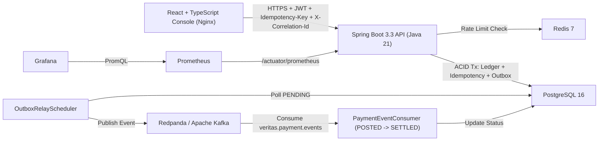
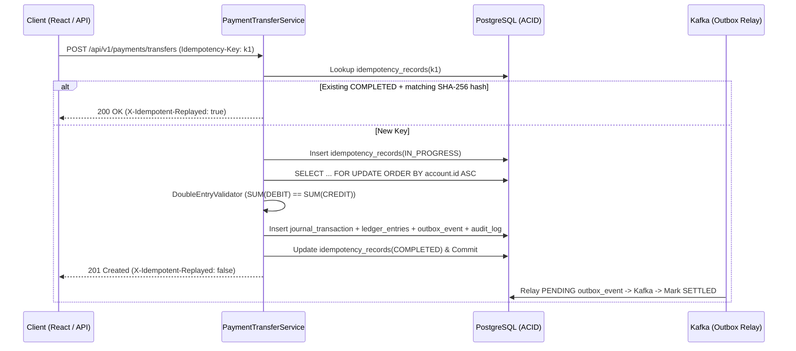

# VeritasPay — System Architecture

## High-Level Component Architecture

```mermaid
flowchart LR
    UI["React + TypeScript Console (Nginx)"] -->|"HTTPS + JWT + Idempotency-Key + X-Correlation-Id"| API["Spring Boot 3.3 API (Java 21)"]
    API -->|"Rate Limit Check"| REDIS["Redis 7"]
    API -->|"ACID Tx: Ledger + Idempotency + Outbox"| PG["PostgreSQL 16"]
    RELAY["OutboxRelayScheduler"] -->|"Poll PENDING"| PG
    RELAY -->|"Publish Event"| KAFKA["Redpanda / Apache Kafka"]
    KAFKA -->|"Consume veritas.payment.events"| CONSUMER["PaymentEventConsumer (POSTED -> SETTLED)"]
    CONSUMER -->|"Update Status"| PG
    PROM["Prometheus"] -->|"/actuator/prometheus"| API
    GRAF["Grafana"] -->|"PromQL"| PROM
```

## Double-Entry Transfer Sequence

```mermaid
sequenceDiagram
    participant C as Client (React / API)
    participant P as PaymentTransferService
    participant DB as PostgreSQL (ACID)
    participant K as Kafka (Outbox Relay)

    C->>P: POST /api/v1/payments/transfers (Idempotency-Key: k1)
    P->>DB: Lookup idempotency_records(k1)
    alt Existing COMPLETED + matching SHA-256 hash
        P-->>C: 200 OK (X-Idempotent-Replayed: true)
    else New Key
        P->>DB: Insert idempotency_records(IN_PROGRESS)
        P->>DB: SELECT ... FOR UPDATE ORDER BY account.id ASC
        P->>P: DoubleEntryValidator (SUM(DEBIT) == SUM(CREDIT))
        P->>DB: Insert journal_transaction + ledger_entries + outbox_event + audit_log
        P->>DB: Update idempotency_records(COMPLETED) & Commit
        P-->>C: 201 Created (X-Idempotent-Replayed: false)
        K->>DB: Relay PENDING outbox_event -> Kafka -> Mark SETTLED
    end
```
